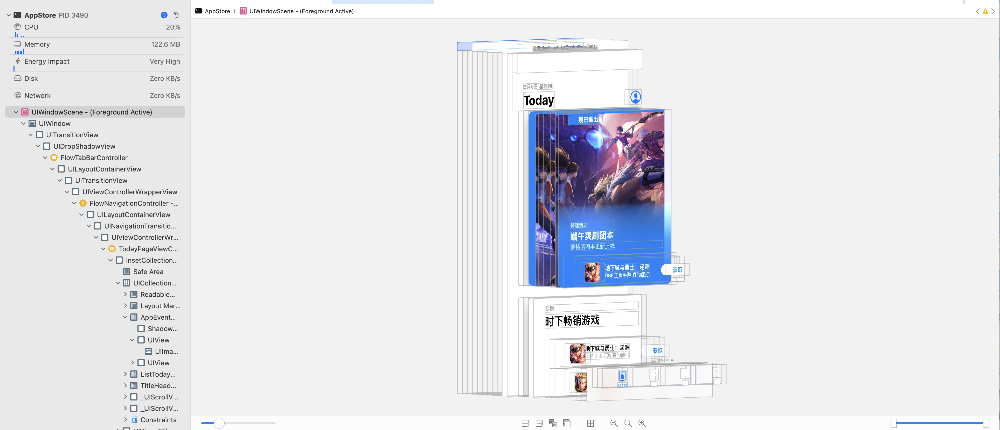

# XcodeDebugRootless

基于 iOS15 Dopamine 越狱的基础上实现，Xcode 调试任意 App

### 有啥用？

没安装这个插件之前你的越狱手机只能调试自己开发的 App，不能调试第三方 App 和系统 App

安装这个插件之后，就可以直接使用 Xcode 调试，使用 LLDB，查看 UI 层级，查看内存分布图，查看类的继承关系.....更有助于平常喜欢使用 Xcode 的选手去逆向。

### 安装

分别安装 Release 里面的 deb 文件，安装后记得重新插拔下手机的 USB 线



### 手动安装

- ```shell
  shell
  git clone https://github.com/DargonLee/XocdeDebugRootless
  cd XocdeDebugRootless
  ```
- ```shell
  make clean
  make
  make package
  ```
- 拷贝 `com.yourcompany.xcodedebugrootless_0.0.1-1+debug_iphoneos-arm64.deb`到手机上，使用 `Filza`安装或者使用 `dkpg`进行安装

### 调试

- 进程已经启动，直接选择"Attach to Process by PID or Name"即可
- 进程未启动，先选择"Attach to Process by PID or Name"并指定进程名，然后启动进程

### Credits

- [lich4/debugserver_azj: Debug any process with XCode easily (github.com)](https://github.com/lich4/debugserver_azj)
- [lemon4ex/XcodeRootDebug: Allow Xcode to start a custom debugserver with root privileges to debug iOS apps. (github.com)](https://github.com/lemon4ex/XcodeRootDebug)
